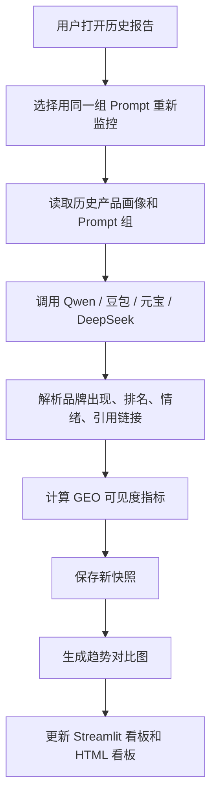

# Topify 竞品对标与 GEO 可见度改造建议

更新时间：2026-07-10

## 1. 文档目标

本文用于记录当前项目与 Topify 在功能、报告结构、UI 可读性上的差异，并给出后续代码改造建议。

本次建议不要求完全复制 Topify。Topify 主攻海外 AI 搜索可见度，重点平台是 ChatGPT、Gemini、Perplexity、Google AI Overview 等；当前项目主攻国内 GEO 售前分析，重点平台是 Qwen、豆包、元宝、DeepSeek，并且还包含百度、搜狗、360、抖音、小红书声量估算、媒介库报价和内容发布建议。

因此，改造目标是：

1. 保留当前项目的国内 GEO 落地能力。
2. 补齐 Topify 更清晰的 AI 可见度指标体系。
3. 将报告首页改成客户一眼能看懂的可视化体检报告。
4. 将 Topify 的自动监控能力先改造成手动监控能力，适配当前项目阶段。

## 2. 当前项目与 Topify 的功能对比

### 2.1 相同点

| 能力 | 当前项目 | Topify |
|---|---|---|
| 品牌 AI 可见度分析 | 已有多 AI 推荐排名 | 已有标准 AI Visibility 报告 |
| 竞品发现 | 已有多 AI 推荐竞品池 | 已有动态竞品对比 |
| Prompt / 用户问题 | 已有 AI 搜索问题生成和记录 | 已有 Prompt 级别分析 |
| 分平台统计 | 已有 Qwen、豆包、元宝、DeepSeek 来源 | 已有 ChatGPT、Gemini 等来源 |
| 可视化报告 | 已有 Streamlit 看板和 HTML 看板 | 已有公开 Web 报告 |
| 历史记录 | 已有历史查询列表 | 有持续监控和时间窗口 |

### 2.2 当前项目比 Topify 多的能力

| 当前项目能力 | 价值 |
|---|---|
| 百度、搜狗、360、抖音、小红书五平台声量估算 | 更适合国内客户理解“全网内容资产差距” |
| 媒介库资源匹配 | 可以直接落到发布渠道 |
| 媒介报价和预算估算 | 可以把 GEO 分析转成销售方案 |
| 文章链接抓取与内容定位分析 | 可以分析竞品宣传重点 |
| 品类边界、消费心理、用户画像、卖点分析 | 更适合售前策略表达 |
| 官网/PDF 产品画像 | 更适合从客户资料直接开始一键分析 |

### 2.3 Topify 比当前项目更成熟的能力

| Topify 能力 | 当前缺口 | 建议 |
|---|---|---|
| AI Visibility Score | 当前没有统一总分 | 新增 GEO 可见度总分 |
| Mentions | 当前有推荐次数，但没有标准化提及数 | 统一统计 AI 回答中品牌出现次数 |
| Avg Position | 当前有平均排名，但展示不够突出 | 增加平均推荐位置图 |
| Sentiment Score | 当前缺少品牌情绪分 | 增加 AI 描述倾向分析 |
| Prompt Success | 当前没有“哪些问题能触发客户品牌”总览 | 增加 Prompt 级成功率 |
| Share of Voice | 当前没有标准 SOV | 增加 AI 推荐份额/提及份额 |
| Source Metrics | 当前链接抓取偏工程明细 | 增加引用来源域名和机会来源分析 |
| 时间窗口 | 当前只有历史报告，没有趋势指标 | 先做手动监控快照，再扩展趋势图 |

## 3. 建议新增的核心指标

### 3.1 GEO 可见度总览指标

新增 `geo_visibility_summary` 数据块。

建议字段：

```json
{
  "visibility_score": 31.3,
  "visibility_level": "low",
  "total_ai_responses": 40,
  "brand_mentioned_responses": 12,
  "mention_count": 18,
  "avg_position": 2.8,
  "sentiment_score": 50,
  "prompt_success_rate": 0.3,
  "provider_coverage_count": 2,
  "provider_total_count": 4,
  "share_of_voice": 0.22
}
```

计算建议：

| 指标 | 计算方式 |
|---|---|
| visibility_score | 客户品牌出现的 AI 回答数 / 总 AI 回答数 * 100 |
| mention_count | 客户品牌在结构化推荐结果和回答文本中的总出现次数 |
| avg_position | 客户品牌出现时的平均排名，越小越好 |
| sentiment_score | AI 对品牌描述的正面程度，0-100 |
| prompt_success_rate | 能触发客户品牌出现的 Prompt 数 / 总 Prompt 数 |
| provider_coverage_count | 出现客户品牌的 AI 平台数量 |
| share_of_voice | 客户品牌提及数 / 所有品牌提及数 |

### 3.2 品牌级指标

新增 `brand_visibility_metrics` 数据块。

每个品牌记录：

```json
{
  "brand_name": "福州美贝尔医疗美容",
  "is_user_brand": true,
  "visibility_score": 31.3,
  "mention_count": 298,
  "avg_position": 2.8,
  "sentiment_score": 50,
  "share_of_voice": 0.22,
  "provider_mentions": {
    "qwen": 80,
    "doubao": 72,
    "yuanbao": 66,
    "deepseek": 80
  }
}
```

### 3.3 Prompt 级指标

新增 `prompt_runs` 数据块。

每个 Prompt 记录：

```json
{
  "prompt": "福州医美机构推荐",
  "intent": "consumer_recommendation",
  "provider": "qwen",
  "brand_mentioned": true,
  "brand_position": 3,
  "sentiment_score": 50,
  "co_occurring_brands": ["福州海峡美容医院", "福州格莱美美容医院"],
  "citation_urls": ["https://example.com/article"],
  "raw_answer_excerpt": "..."
}
```

## 4. 代码模块改造建议

### 4.1 新增模块：`geo_app/geo_visibility_metrics.py`

职责：

1. 从 `recommendation_items`、`multi_ai_recommendation_results`、`ai_recommendation_ranking` 中计算标准 GEO 可见度指标。
2. 生成品牌级指标、平台级矩阵、Prompt 级成功率。
3. 给报告渲染层提供统一的数据结构。

建议函数：

```python
def build_geo_visibility_summary(data: dict[str, Any]) -> dict[str, Any]:
    ...

def build_brand_visibility_metrics(data: dict[str, Any]) -> list[dict[str, Any]]:
    ...

def build_provider_visibility_matrix(data: dict[str, Any]) -> list[dict[str, Any]]:
    ...

def build_prompt_visibility_rows(data: dict[str, Any]) -> list[dict[str, Any]]:
    ...
```

### 4.2 新增模块：`geo_app/sentiment_scoring.py`

职责：

1. 对 AI 推荐理由、回答摘要、文章内容做情绪倾向分析。
2. 输出品牌情绪分、正面词、风险词、典型描述。
3. 优先使用已有 AI 结构化返回；不足时由 Qwen/DeepSeek 进行补充分析。

建议字段：

```json
{
  "brand_name": "福州美贝尔医疗美容",
  "sentiment_score": 50,
  "sentiment_label": "neutral",
  "positive_terms": ["专业", "连锁", "医生资质"],
  "risk_terms": ["价格不透明", "评价分化"],
  "evidence": "AI 回答中主要以中性推荐为主。"
}
```

### 4.3 调整模块：`geo_app/multi_ai_geo_workflow.py`

当前逻辑偏向“一个主流推荐问题 + 多 AI 回答”。建议升级为“Prompt 组 + 多 AI 回答”。

调整建议：

1. 保留当前 `build_recommendation_question(profile)`，作为主问题。
2. 新增 `build_prompt_set(profile)`，生成 5-10 个真实用户问题。
3. 每个 Prompt 分别调用 Qwen、豆包、元宝、DeepSeek。
4. 每次调用都保存：
   - provider
   - model
   - prompt
   - raw answer
   - parsed recommendations
   - citation urls
   - error
5. 从所有 Prompt 结果中汇总推荐排名和可见度指标。

建议新增输出：

```python
return {
    ...
    "prompt_runs": prompt_runs,
    "geo_visibility_summary": summary,
    "brand_visibility_metrics": brand_metrics,
    "provider_visibility_matrix": provider_matrix,
}
```

### 4.4 新增模块：`geo_app/prompt_monitor.py`

Topify 有自动监控。当前项目先做手动监控。

职责：

1. 保存本次报告使用的 Prompt 组。
2. 支持历史报告中点击“用同一组问题重新监控”。
3. 保存每次监控快照。
4. 对比最近几次可见度分数、平均排名、情绪分变化。

建议数据结构：

```json
{
  "monitor_id": "brand_20260710_xxxxxx",
  "brand_name": "福州美贝尔医疗美容",
  "prompt_set": ["福州医美推荐", "..."],
  "snapshots": [
    {
      "run_id": "20260710T120000_xxxxxx",
      "created_at": "2026-07-10T12:00:00+08:00",
      "visibility_score": 31.3,
      "avg_position": 2.8,
      "sentiment_score": 50
    }
  ]
}
```

### 4.5 调整模块：`geo_app/integrated_report_renderer.py`

职责调整：

1. 渲染客户优先阅读的可视化摘要。
2. 将工程明细、原始表格、错误日志放入折叠区域。
3. 保证 Streamlit 看板和 HTML 下载看板结构一致。

建议新增渲染函数：

```python
def build_visibility_kpi_payload(data: dict[str, Any]) -> dict[str, Any]:
    ...

def build_prompt_performance_payload(data: dict[str, Any]) -> dict[str, Any]:
    ...

def build_provider_matrix_payload(data: dict[str, Any]) -> dict[str, Any]:
    ...

def build_sentiment_payload(data: dict[str, Any]) -> dict[str, Any]:
    ...
```

### 4.6 调整模块：`app.py`

建议 UI 变更：

1. 历史查询列表增加：
   - 查看报告
   - 下载完整 HTML 看板
   - 用同一组 Prompt 重新监控
2. 结果页增加新的一级页签：
   - GEO 可见度总览
   - AI 推荐排名
   - 五平台声量
   - 内容定位分析
   - 媒介成本
   - 原始数据
3. DEV CONSOLE 保留最后代码修改时间，并显示当前运行使用的工作流版本。

## 5. UI 布局改造建议

### 5.1 报告首页顺序

建议把报告首页改成以下顺序：

1. 顶部 KPI 总览。
2. AI 可见度体检。
3. AI 平台来源和 Prompt 表现。
4. 竞品可见度对比。
5. 五平台内容声量。
6. 内容定位与品牌资产分析。
7. GEO 优化建议与媒介成本。
8. 原始数据和抓取日志。

### 5.2 顶部 KPI 卡片

顶部展示 6 个卡片：

| 卡片 | 说明 |
|---|---|
| GEO 可见度总分 | 客户品牌在 AI 回答中出现比例 |
| AI 提及次数 | 客户品牌被 AI 提到的次数 |
| 平均推荐位置 | 客户品牌平均排第几 |
| 情绪分 | AI 对客户品牌描述倾向 |
| Prompt 成功率 | 多少问题能触发客户品牌 |
| 平台覆盖 | 多少 AI 平台推荐过客户品牌 |

### 5.3 第一部分：AI 推荐可见度

建议图表：

1. 综合 AI 推荐排名柱状图。
2. 分 AI 平台推荐来源饼图。
3. AI 平台 x 品牌推荐热力图。
4. 平均推荐位置排名。
5. 客户品牌是否出现的 Prompt 成功率图。

细节放入折叠区：

1. 每个 AI 平台原始推荐列表。
2. 每个 Prompt 的返回摘要。
3. 错误和失败原因。

### 5.4 第二部分：五平台内容声量

建议图表：

1. 百度、搜狗、360、抖音、小红书总占比饼图。
2. 品牌五平台声量堆叠图。
3. 客户品牌 vs 前三竞品差距图。
4. 分 AI 平台声量估算对比图。

注意：

1. 图表为空时不能显示空白图。
2. 应显示“本轮未获取有效估算”，并说明原因。
3. 不能用 `0` 假装没有声量，除非明确确认该平台为 0。

### 5.5 第三部分：内容定位分析

当前内容定位容易变成大段文字。建议改成图表优先：

1. 品类边界分布图。
2. 客单价/价格带分布图。
3. 消费心理动机图。
4. 用户画像分布图。
5. 卖点数量和卖点类型图。
6. 数字资产评分图。

每个品牌的详细文字分析放入折叠区。

### 5.6 第四部分：GEO 优化建议

建议独立成客户最关心的结论页：

1. 当前 AI 可见度问题。
2. 客户品牌相对前三竞品的差距。
3. 应优先补充的内容类型。
4. 推荐发布平台。
5. 建议发布篇数。
6. 媒介成本区间。
7. 30 天执行路线图。

## 6. 手动监控流程建议

自动监控暂时不做，先实现手动监控。

流程：



## 7. 推荐实施顺序

### 阶段 1：补齐指标层

优先级最高。

1. 新增 `geo_visibility_metrics.py`。
2. 在 `integrated_data.json` 中写入 `geo_visibility_summary`。
3. 在 Streamlit 和 HTML 首页展示 KPI。
4. 增加平均位置、情绪分、Prompt 成功率。

验收标准：

1. 客户打开报告第一屏就能看到 GEO 总分。
2. 能看到自己品牌排名第几、被提到多少次、在哪些 AI 平台出现。
3. 不需要看原始表格也能理解问题。

### 阶段 2：Prompt 组改造

1. 从单一主问题升级为 5-10 个 Prompt。
2. 每个 Prompt 调四个 AI。
3. 生成 Prompt 级可见度表和图。

验收标准：

1. 能看到“哪些问题客户品牌出现，哪些问题没出现”。
2. 能看到每个问题的共现竞品。
3. 能复用这组问题做手动监控。

### 阶段 3：HTML 看板重排

1. 统一 Streamlit 看板和下载 HTML 看板结构。
2. 客户视角先看图，细节折叠。
3. 原始 JSON、错误日志、抓取失败放到最后。

验收标准：

1. 下载 HTML 与 Streamlit 看板内容一致。
2. 三大核心模块完整：AI 推荐、五平台声量、内容定位。
3. 图表为空时有明确提示，不出现空白图。

### 阶段 4：手动监控

1. 历史报告增加“重新监控”。
2. 保存监控快照。
3. 展示最近几次 GEO 可见度变化。

验收标准：

1. 重新打开官网能看到历史记录。
2. 能用历史 Prompt 再跑一次。
3. 能看到可见度分数、平均排名、情绪分的变化。

## 8. 当前需要确认的问题

### 8.1 指标定义是否采用 Topify 风格

建议采用，但命名改成本项目适合国内客户的表达：

| Topify 叫法 | 建议中文叫法 |
|---|---|
| AI Visibility Score | GEO 可见度总分 |
| Mentions | AI 提及次数 |
| Avg Position | 平均推荐位置 |
| Sentiment Score | AI 描述情绪分 |
| Share of Voice | AI 推荐份额 |
| Prompts: Mentions | 问题触发表现 |

### 8.2 五平台声量是否继续保留

建议保留。

原因：这是本项目相对 Topify 的差异化能力。国内客户更容易理解“百度、小红书、抖音内容资产差距”，也更容易转化成媒介预算。

### 8.3 声量估算的数据可信度如何表达

建议明确标注：

1. “AI 估算”不是平台官方真实接口统计。
2. 每个品牌、每个平台都要记录 `confidence`。
3. 没拿到数据时显示“未获取”，不要显示为 0。
4. 后续如果接入真实搜索 API，再替换该字段来源。

### 8.4 是否现在做自动监控

不建议马上做自动监控。

当前建议先做手动监控：

1. 成本可控。
2. API 调用失败更容易排查。
3. 用户先能验证报告价值。
4. 后续再扩展定时任务。

### 8.5 是否需要完全照搬 Topify 报告布局

不建议完全照搬。

建议借鉴它的第一屏和指标体系，但保留本项目自己的四段式报告：

1. AI 推荐可见度。
2. 五平台内容声量。
3. 品牌内容与定位分析。
4. GEO 优化建议与媒介成本。

## 9. 结论

当前项目不缺分析能力，主要缺少一套客户一眼能看懂的“标准 GEO 可见度指标”和更清晰的报告首页。

下一步最值得优先做的是：

1. 新增 GEO 可见度指标层。
2. 把报告首页改成 KPI + 图表优先。
3. 从单一主问题升级为 Prompt 组。
4. 增加手动监控入口。

这四项完成后，当前项目会从“能生成很多分析内容”升级为“客户一眼看懂为什么要做 GEO，以及差距在哪里”。
